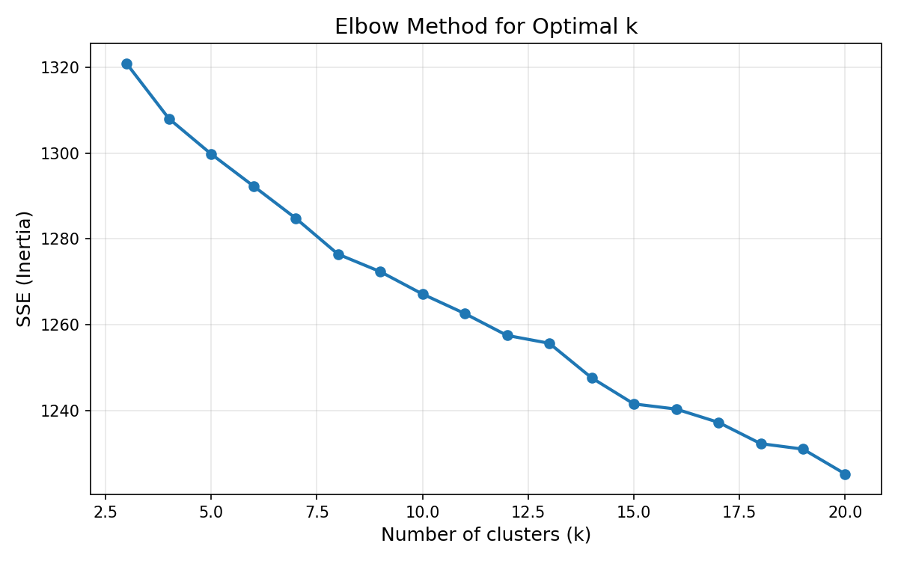

# 主题聚类分析skill

对中英文文本做分词、向量化、聚类，输出带簇标签的 Excel 和每簇 Top N 关键词。

支持 **KMeans**、**层次聚类**、**LDA** 三种方法，含肘部法辅助选 K。

---

## 功能

- 中英文自动检测与预处理（jieba 中文分词 / spaCy 英文词形还原）
- TF-IDF 向量化
- 三种聚类方法：KMeans（+ 肘部法选 K）、层次聚类（+ 树状图）、LDA 主题模型
- 逐簇关键词提取（TF-IDF centroid）和**高频词统计**（原始词频 + 频次）
- 逐簇交互式三选一命名
- 输出 Excel 文件，含原始数据标注、簇关键词、簇高频词、簇统计四个 sheet
- 可选：每簇词云图生成

---

## 安装

### 方式一：Claude Code Skill 安装（推荐）

在 Claude Code 对话中直接说：

> "帮我安装 topic-clustering skill，从 https://github.com/mpz255-eng/topic-clustering-skill"

或者手动安装：

```bash
# 1. 克隆到 Claude Code skills 目录
git clone https://github.com/mpz255-eng/topic-clustering-skill \
  ~/.claude/skills/topic-clustering

# 2. 安装 Python 依赖
pip install -r ~/.claude/skills/topic-clustering/requirements.txt

# 3. 安装 spaCy 英文模型（处理英文文本时需要）
python -m spacy download en_core_web_sm
```

安装后，在 Claude Code 对话中说出以下关键词即可自动触发 skill：

> "主题聚类"、"文本聚类"、"KMeans聚类"、"LDA主题模型"、"层次聚类文本"、"文本自动分组"、"给这些新闻分个类"……

Skill 会以**交互式向导模式**运行：检测语种 → 预处理 → 向量化 → 选 K → 聚类 → 逐簇命名 → 导出。

### 方式二：命令行独立使用

```bash
git clone https://github.com/mpz255-eng/topic-clustering-skill.git
cd topic-clustering-skill
pip install -r requirements.txt
python -m spacy download en_core_web_sm
```

完整 CLI 流程：

```bash
WORKSPACE="./workspace"
DATA="./examples/sample_news.xlsx"
TEXT_COL="content"

# 1. 语言检测
python cluster.py detect --input "$DATA" --text-col "$TEXT_COL"

# 2. 预处理（分词 + 去停用词）
python cluster.py preprocess \
  --input "$DATA" --text-col "$TEXT_COL" \
  --output "$WORKSPACE/preprocessed.pkl"

# 3. TF-IDF 向量化
python cluster.py vectorize \
  --input "$WORKSPACE/preprocessed.pkl" \
  --output "$WORKSPACE/vectorized.pkl"

# 4. 肘部法（辅助选 K）
python cluster.py elbow \
  --input "$WORKSPACE/vectorized.pkl" \
  --output "$WORKSPACE/elbow.png" \
  --k-range 3 20

# 5. 执行聚类（KMeans, K=8）
python cluster.py fit \
  --input "$WORKSPACE/vectorized.pkl" \
  --texts "$WORKSPACE/preprocessed.pkl" \
  --method kmeans --k 8 \
  --output "$WORKSPACE/model.pkl" \
  --labels-output "$WORKSPACE/labels.csv"

# 6. 导出结果（可选传 --cluster-names 命名簇）
python cluster.py export \
  --input "$DATA" --text-col "$TEXT_COL" \
  --labels "$WORKSPACE/labels.csv" \
  --keywords "$WORKSPACE/model.pkl" \
  --output "./聚类结果.xlsx" \
  --cluster-names '{"0":"版权声明（噪声）","1":"AI安全与法律规制",...}'
```

---

## 多平台支持

`cluster.py` 本身是标准 Python CLI，可被任何 LLM agent 调用。`prompts/` 目录下提供了各平台的驱动模板：

| 文件 | 适用平台 |
|---|---|
| `SKILL.md` | Claude Code（原生 skill，自动触发） |
| `prompts/system-prompt.md` | 通用 LLM（ChatGPT、Claude、Gemini 等） |
| `prompts/cursor-rule.mdc` | Cursor（`.cursor/rules/` 下使用） |
| `prompts/custom-gpt-instructions.md` | OpenAI Custom GPT |

核心思路一致：将模板内容交给对应 LLM，LLM 即会以交互式向导模式引导用户完成 检测→预处理→向量化→聚类→导出 全流程。

---

## 输出

Excel 文件包含 4 个 sheet：

| Sheet | 内容 |
|---|---|
| 原始数据 | 原始数据 + `cluster_label` + `cluster_name` |
| 簇关键词 | 每簇 TF-IDF centroid Top 30 关键词 |
| 簇高频词 | 每簇 Top 20 高频词 + 频次 |
| 簇统计 | 每簇文档数、占比 |

---

## 聚类方法

| 方法 | 原理 | 适用场景 |
|---|---|---|
| KMeans | 距离最小化，球形簇 | 大多数场景，速度快，首选 |
| 层次聚类 | 自底向上合并最相似簇 | 探索层级结构，数据量 < 500 |
| LDA | 概率生成模型 | 长文本（论文、报告），软分类 |

详见 [references/algorithm-guide.md](references/algorithm-guide.md)。

---

## 实际案例

使用本工具对中国日报（China Daily）2015-2026 年 1424 篇 AI 主题英文报道做主题聚类。

### K 值选择：肘部法

聚类前，先生成肘部法 SSE 曲线图辅助选择最佳 K 值：



观察曲线拐点：K=3 到 K=12 之间 SSE 下降速率较快，K=12 之后下降明显趋缓。综合考虑主题粒度和可解释性，选择 **K=12**。

### 聚类结果概览

| 簇 | 命名 | 篇数 | 占比 |
|---|---|---|---|
| 0 | 版权声明（噪声） | 12 | 0.8% |
| 1 | AI安全与法律规制 | 76 | 5.3% |
| 2 | 国际AI治理与合作 | 88 | 6.2% |
| 3 | 大模型产品与消费应用 | 171 | 12.0% |
| 4 | 自动驾驶与智能出行 | 54 | 3.8% |
| 5 | 产业数字化与智能制造 | 258 | 18.1% |
| 6 | AI政策与政府议程 | 130 | 9.1% |
| 7 | AI+医疗健康 | 60 | 4.2% |
| 8 | AI+教育 | 97 | 6.8% |
| 9 | AI与社会文化 | 384 | 27.0% |
| 10 | AI消费电子硬件 | 31 | 2.2% |
| 11 | 算力与芯片基础设施 | 63 | 4.4% |

### 各簇 Top 20 高频词

**Cluster 0 — 版权声明（噪声）**（12 篇）

`content(24)` `information(24)` `cdic(24)` `copyright(12)` `right(12)` `reserve(12)` `include(12)` `limit(12)` `text(12)` `photo(12)` `multimedia(12)` `publish(12)` `site(12)` `belong(12)` `co(12)` `write(12)` `authorization(12)` `republish(12)` `form(12)` `share(4)`

**Cluster 1 — AI安全与法律规制**（76 篇）

`technology(212)` `security(196)` `datum(152)` `law(136)` `generate(131)` `cybersecurity(124)` `development(117)` `content(108)` `voice(104)` `information(97)` `service(96)` `application(84)` `legal(81)` `system(81)` `risk(79)` `company(78)` `right(77)` `public(77)` `court(76)` `new(75)`

**Cluster 2 — 国际AI治理与合作**（88 篇）

`governance(506)` `development(379)` `country(337)` `international(282)` `technology(266)` `cooperation(254)` `develop(140)` `promote(131)` `capacity(123)` `risk(113)` `technological(110)` `framework(106)` `security(104)` `initiative(99)` `benefit(99)` `ensure(98)` `resolution(97)` `system(95)` `innovation(94)` `build(91)`

**Cluster 3 — 大模型产品与消费应用**（171 篇）

`model(596)` `company(391)` `technology(370)` `year(307)` `user(289)` `language(268)` `new(240)` `industry(237)` `product(223)` `large(209)` `market(207)` `platform(197)` `video(195)` `power(185)` `service(183)` `application(179)` `consumer(157)` `development(156)` `deepseek(156)` `tool(151)`

**Cluster 4 — 自动驾驶与智能出行**（54 篇）

`vehicle(231)` `company(121)` `autonomous(121)` `driving(111)` `drive(106)` `intelligent(101)` `technology(99)` `year(92)` `system(82)` `model(77)` `industry(77)` `new(61)` `percent(58)` `smart(54)` `car(51)` `service(49)` `large(46)` `development(46)` `level(46)` `market(43)`

**Cluster 5 — 产业数字化与智能制造**（258 篇）

`technology(936)` `industry(820)` `development(696)` `company(661)` `new(639)` `model(594)` `year(585)` `application(519)` `percent(486)` `innovation(463)` `industrial(444)` `digital(431)` `large(403)` `enterprise(389)` `sector(385)` `high(373)` `datum(372)` `market(372)` `drive(330)` `business(325)`

**Cluster 6 — AI政策与政府议程**（130 篇）

`technology(365)` `development(274)` `country(256)` `innovation(185)` `model(177)` `government(149)` `digital(148)` `governance(148)` `cooperation(137)` `system(136)` `risk(132)` `industry(132)` `year(128)` `international(128)` `new(127)` `develop(127)` `application(127)` `include(121)` `need(119)` `safety(117)`

**Cluster 7 — AI+医疗健康**（60 篇）

`medical(268)` `hospital(169)` `patient(154)` `health(131)` `system(127)` `model(113)` `technology(112)` `disease(101)` `healthcare(100)` `clinical(98)` `datum(95)` `doctor(92)` `research(85)` `cancer(85)` `diagnosis(80)` `develop(76)` `help(74)` `year(72)` `medicine(67)` `application(66)`

**Cluster 8 — AI+教育**（97 篇）

`education(604)` `student(478)` `school(284)` `technology(206)` `university(196)` `high(148)` `use(144)` `tool(128)` `learn(116)` `development(116)` `research(114)` `academic(113)` `system(110)` `teacher(108)` `new(106)` `model(101)` `digital(99)` `learning(99)` `innovation(97)` `course(93)`

**Cluster 9 — AI与社会文化**（384 篇）

`technology(547)` `model(432)` `human(357)` `year(320)` `new(267)` `datum(260)` `development(259)` `industry(256)` `system(256)` `team(222)` `digital(206)` `large(200)` `people(199)` `time(196)` `work(196)` `include(194)` `research(187)` `company(186)` `language(180)` `develop(179)`

**Cluster 10 — AI消费电子硬件**（31 篇）

`smartphone(137)` `company(73)` `market(70)` `pc(66)` `device(63)` `user(50)` `year(47)` `technology(43)` `power(43)` `percent(41)` `new(40)` `model(39)` `experience(35)` `application(35)` `large(34)` `late(32)` `shipment(32)` `industry(31)` `language(28)` `product(27)`

**Cluster 11 — 算力与芯片基础设施**（63 篇）

`model(263)` `computing(197)` `power(188)` `company(178)` `technology(169)` `industry(145)` `chip(144)` `development(117)` `large(108)` `datum(106)` `center(106)` `application(105)` `cloud(102)` `compute(95)` `innovation(88)` `new(83)` `high(82)` `year(81)` `infrastructure(76)` `develop(67)`

---

## 命令行参考

```
cluster.py detect      语言检测
cluster.py preprocess  分词 + 去停用词
cluster.py vectorize   TF-IDF 向量化
cluster.py elbow       肘部法 SSE 图
cluster.py dendrogram  层次聚类树状图
cluster.py fit         执行聚类
cluster.py export      导出 Excel
cluster.py wordcloud   生成词云图
```

---

## 依赖

- Python 3.9+
- numpy, pandas, scikit-learn
- jieba（中文分词）
- spaCy + en_core_web_sm（英文分词）
- matplotlib（图表）
- openpyxl（Excel 导出）
- scipy（层次聚类树状图，可选）
- wordcloud（词云图，可选）

---

## License

MIT
